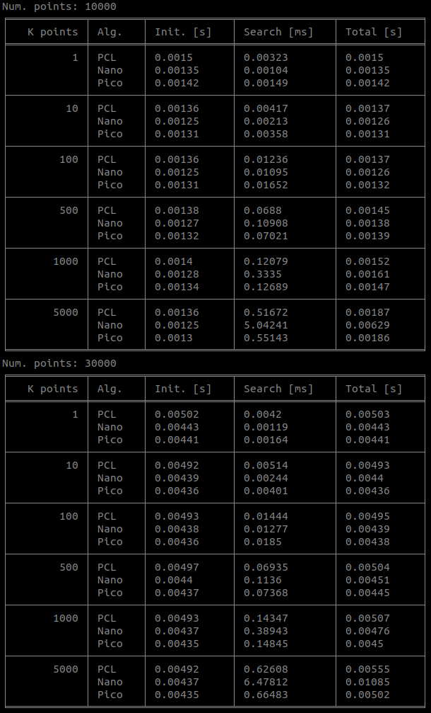
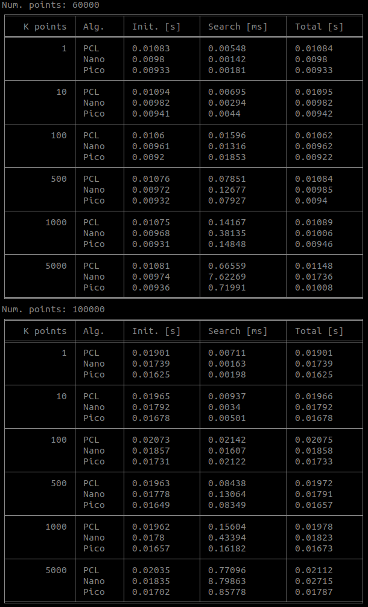
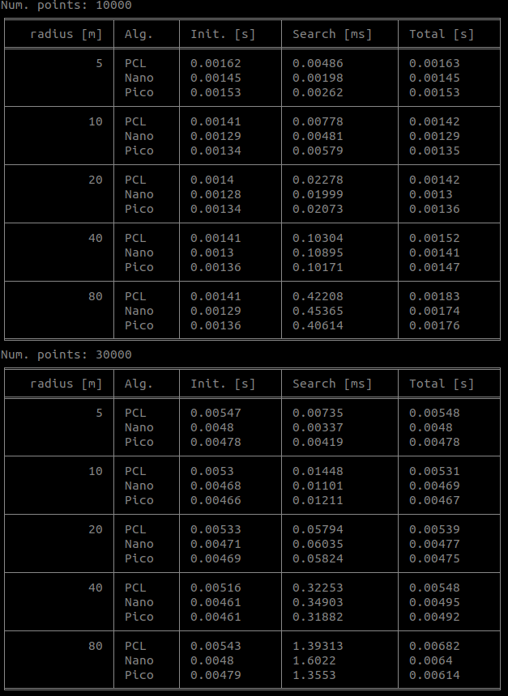
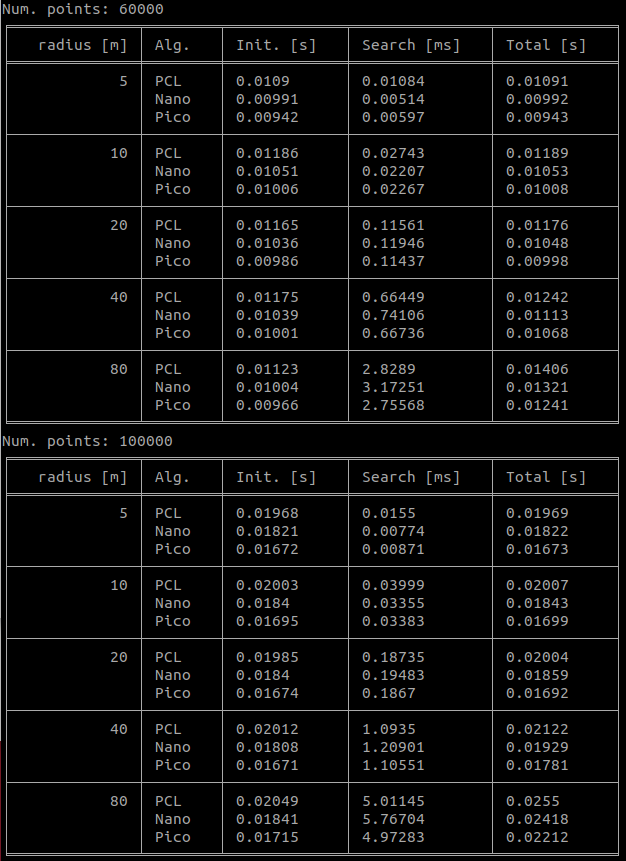
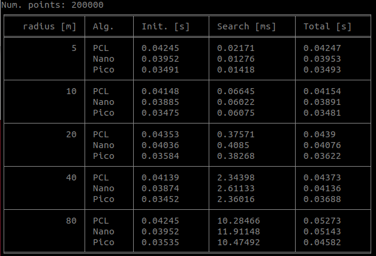

# OpenFLANN

I found PicoFLANN and compare the speed of alorithms, namely *PCL FLANN*, *NanoFLANN*, and *PicoFLANN*.

## Characteristics

* Set NanoFLANN and PicoFLANN to be avaiable on Point Cloud Libarary (PCL).
* It's simple to use them! Just git pull this repository, then copy & paste the header files in `include` folder.
* Usage is totally same with Point Cloud Library, i.e., `setInputCloud`, `nearestSearch`, or `radiusSearch`.  
* Many robotics guys refer to [NanoFLANN in LOAM](https://github.com/laboshinl/loam_velodyne/blob/master/include/loam_velodyne/nanoflann_pcl.h); however, the function `radiusSearch` in LOAM is actually not in use so the function does not work properly. So, I debugged it and revise the `radiusSearch`.
## Reference    
* [PCL FLANN](https://pointclouds.org/documentation/tutorials/kdtree_search.html)
* [NanoFLANN](https://github.com/jlblancoc/nanoflann)
* [PicoFLANN](https://github.com/rmsalinas/picoflann) (The original developer says it is faster than NanoFLANN, and it actually is when the scale of points becomes larger)


## Simulation results

Experiments: Please refer to `src/main.cpp`. I reran the experiment 1,000 times to measure mean speed of each case.

One-line summary: For robotics application, NanoFLANN is better than other FLANN implementations.

You can show the results via python code (tabulate is necessary)
```
cd outputs
python viz_output.py
```

### K-Nearest Neighbor






### Radius Search








