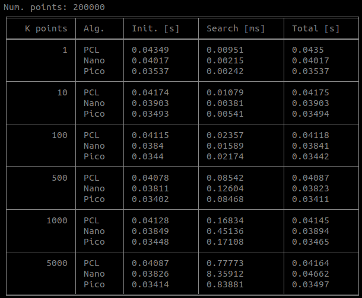

# OpenFLANN

I found PicoFLANN and compare the speed of alorithms, namely *PCL FLANN*, *NanoFLANN*, and *PicoFLANN*.

## Characteristics

* Set NanoFLANN and PicoFLANN to be avaiable on Point Cloud Libarary (PCL).
* It's simple to use them! Just git pull this repository, then copy & paste the header files in `include` folder.

## Reference    
* [PCL FLANN](https://pointclouds.org/documentation/tutorials/kdtree_search.html)
* [NanoFLANN](https://github.com/jlblancoc/nanoflann)
* [PicoFLANN](https://github.com/rmsalinas/picoflann) (The original developer says it is faster than NanoFLANN, but it isn't for robotics applications)


## Simulation results

Experiments: Please refer to `src/main.cpp`. I reran the experiment 1,000 times to measure mean speed of each case.

One-line summary: For robotics application, NanoFLANN is better than other FLANN implementations.

You can show the results via python code (tabulate is necessary)
```
cd outputs
python viz_output.py
```

### K-Nearest Neighbor





### Radius Search


